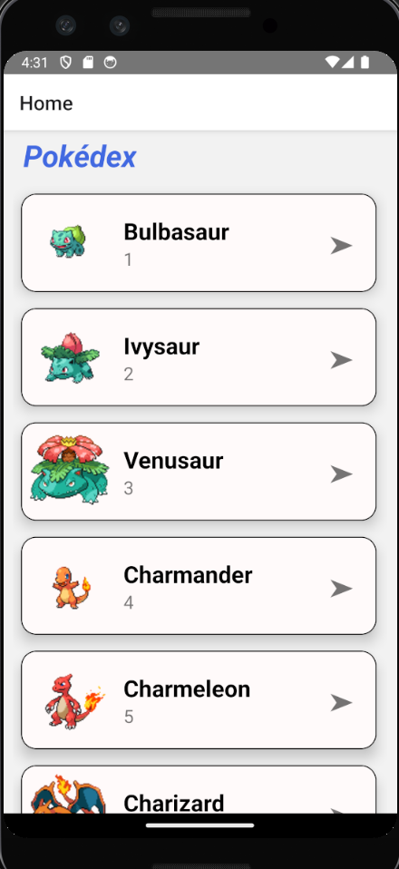
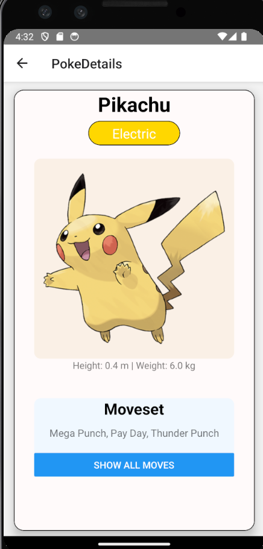
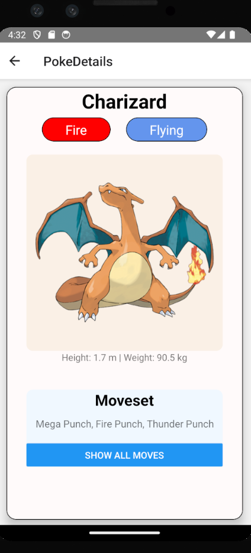

# Pokedex

A simple mobile application developped using React Native with Typescript.

## Overview

This app acts as a portable Pokedex such that you can retrieve detailed information on any Pokemon.

## Screens

### List View

Displays a list of Pokemon, viewing 50 Pokemon at a time. Each Pokemon display a picture, their name, and Pokemon number. Click on any Pokemon to view its details.

### Details View

Displays the details of a selected Pokemon from the List View. This screen shows the name, type(s), height, weight, and moves that the Pokemon can learn.

